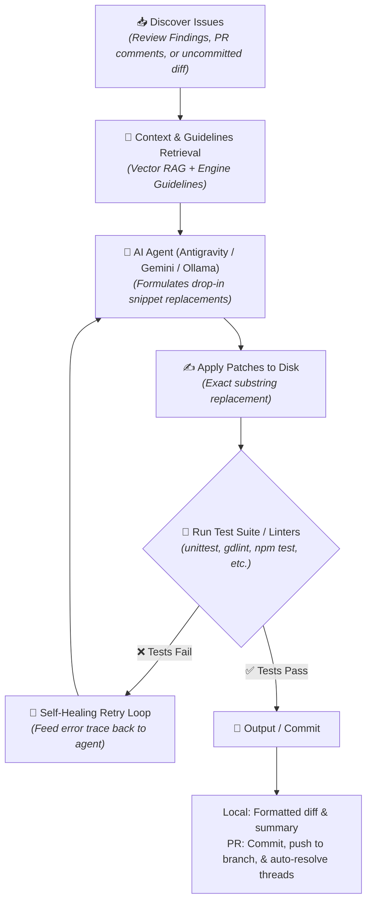

# 🛠️ Autonomous Code Repair (`FixService`)

Poing AI includes an **Autonomous Code Repair Engine** that reads review findings, compiler errors, or test failures, uses AI agents to formulate drop-in code replacements, applies patches to disk, and executes project test suites (`unittest`, `gdlint`, `npm test`, `dotnet test`) in a closed-loop validation cycle.

---

## 🏛️ How Autonomous Repair Works



---

## 🚀 Running Locally with the CLI

### 1. Auto-Fix with Google Antigravity Managed Agent (Recommended)

Powered by Google's **Interactions API** (`antigravity-preview-05-2026`) with remote Linux sandboxing:

```bash
# Fix uncommitted bugs in your workspace using Antigravity
poing --local --fix --provider antigravity
```

### 2. Fast Auto-Fix with Gemini Flash

```bash
poing --local --fix --provider gemini --model gemini-3.7-flash
```

### 3. 100% Offline Auto-Fix with Ollama

```bash
poing --local --fix --provider ollama --model deepseek-r1:latest
```

---

## 💬 Triggering Auto-Fix in GitHub Pull Requests

When Poing AI flags issues or you want automated fixes on a PR:

1. Comment `/fix` or `@poing-ai fix` on the pull request.
2. Poing AI:
   - Fetches unresolved review threads.
   - Generates and tests the required code repairs.
   - Commits the fixes under `poing-ai[bot]`.
   - Pushes directly to the PR branch.
   - Auto-resolves the review threads.

---

## 🎯 Autonomous Issue Worker (Opt-in)

Poing AI can listen to issues, solve them, and open ready-to-merge Pull Requests. **This feature is disabled by default** to give repository maintainers full control.

### How to Trigger Issue Auto-Fix
1. **On-demand via Comment (Default)**: Comment `/fix` or `/work` on any open issue.
2. **Label Opt-in**: Add the `auto-fix` or `poing-work` label to the issue.
3. **Automatic for All Issues**: Enable in `.github/poing.json`:
   ```json
   "fix": {
     "enabled": true,
     "auto_work_on_issues": true
   }
   ```

### Issue Worker Lifecycle
1. **Context & Target Discovery**: Extracts referenced file paths from the issue and queries the Vector RAG retriever to identify relevant source files.
2. **Patching & Test Execution**: Generates drop-in snippet fixes and executes the project's test suite to verify the repair.
3. **Branch & Pull Request Creation**: Creates branch `fix/issue-<id>-<slug>`, commits the tested changes, pushes to origin, and opens a Pull Request linking to `Closes #<id>`.
4. **Issue Notification**: Posts a confirmation comment on the issue with a link to the generated PR.

---

## ⚙️ Test Runner Auto-Detection

The fixer automatically detects and executes your repository's test runner to verify fixes before finalizing:

| Project Type | Detected Test / Lint Command |
|---|---|
| **Python** | `python3 -m unittest discover tests` |
| **Godot Engine** | `gdlint .` |
| **Node.js / Web** | `npm test` |
| **Custom** | Configured via `test_command` in `.github/poing.json` |

If tests fail during a fix attempt, Poing AI feeds the failure stack trace back into the agent for up to 3 iterative repair attempts.
