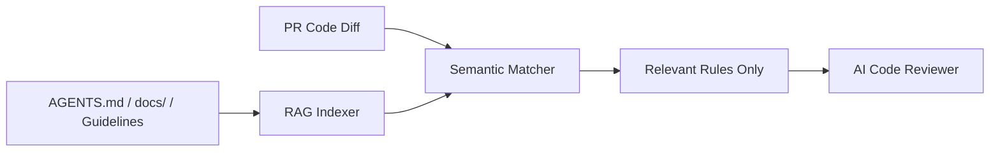

# RAG & Guidelines Retrieval

Poing AI includes a built-in **RAG (Retrieval-Augmented Generation)** engine that allows the AI to learn and enforce your repository's custom architectural guidelines and style rules.

---

## 🧠 How RAG Works

Instead of blindly sending entire documentation folders on every review—which inflates token costs and confuses the AI—Poing AI performs semantic retrieval:



1. **Document Ingestion**: Poing AI scans Markdown files across your project (such as `AGENTS.md`, `CONTRIBUTING.md`, `docs/`, and `.agents/rules/`).
2. **Chunking & Indexing**: Rules and architecture notes are broken down into logical sections and indexed into semantic embeddings or structured rule maps.
3. **Contextual Matching**: When a pull request modifies code, Poing AI extracts the modified languages, directories, and files, querying the index for *only the guidelines relevant to those changes*.
4. **Targeted Enforcement**: The AI reviews the code with the exact project rules in context (e.g. enforcing Godot `:=` syntax only on GDScript files).

---

## ⚙️ RAG Providers

Poing AI supports two RAG engines:

### 1. `local` (Default)
A zero-dependency, lightweight markdown scanner that parses markdown headings, guidelines, and rule blocks directly from disk without external embedding models.

### 2. `vector`
Uses semantic vector embeddings to perform cosine similarity searches across large documentation repositories.

Supported embedders:
- **`gemini`**: Uses Google's `text-embedding-004`
- **`ollama`**: Uses local models like `nomic-embed-text`
- **`openai`**: Uses `text-embedding-3-small`

---

## 📁 Configuring Guidelines in `poing.json`

Customize the directories and RAG provider in `.github/poing.json`:

```json
{
  "review": {
    "rag": {
      "enabled": true,
      "provider": "local",
      "guidelines_dirs": [
        ".agents",
        "docs",
        "guidelines"
      ]
    }
  }
}
```

---

## 🧪 Advanced Code-Intelligence RAG

Beyond project guidelines, Poing AI employs two specialized code-level RAG analyzers during review:

### 1. Test-Suite Pairing RAG
When a source file is modified in a pull request (e.g. `src/poing_ai/services/review_service.py`), Poing AI automatically searches the repository to locate its matching test suite (`tests/test_services.py` or `tests/test_review_service.py`).
- Passes test contents to the AI reviewer.
- Checks whether new code paths, error states, and branches have corresponding test coverage.

### 2. Cross-File Symbol Impact Analysis
When new methods, functions, or classes are modified in the diff (e.g. `def calculate_total()`, `func _on_event()`, `public void Init()`):
- Scans all files across the repository for external call sites and usages.
- Provides a summary of dependent callers directly in the review prompt so the AI can verify that signature changes do not break external modules.

---

## 💡 Best Practices for Guidelines

To make your repository guidelines most effective with Poing AI:

- Keep rule files in **Markdown** format (`AGENTS.md`, `.agents/rules/*.md`).
- Use clear headings (e.g. `## GDScript Rules`, `## Architecture Guidelines`).
- Include code examples showing both correct and incorrect patterns.
