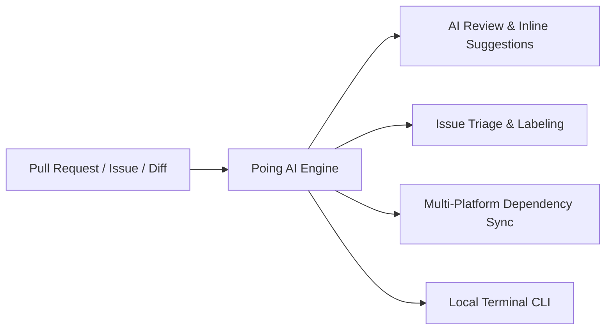

# 🤖 Poing AI

<p align="center">
  <strong>Intelligent AI Code Review, Issue Triage, and Multi-Platform Dependency Automation</strong>
</p>

---

## What is Poing AI?

**Poing AI** is an enterprise-grade AI bot, developer CLI, and GitHub Action designed to automate the developer workflow for game engines (**Godot**, **Unity**, **Unreal**) and multi-platform native software (**Android**, **iOS**, **C#**, **C++**, **Rust**, **Python**).



---

## ⚡ Key Capabilities

=== "🔍 Intelligent Code Review"
    - **Full-File Ground Truth**: Inspects full files alongside diffs to prevent hallucinating missing methods or context.
    - **Engine Rules**: Custom analyzers for Godot (`:=` static inference, `class_name` internal encapsulation), Unity, and Unreal.
    - **Anti-Hallucination**: Queries the live GitHub API in real time to verify GitHub Actions versions.
    - **Thumbs-Down Learning**: Permanently eliminates recurring false positives by learning from developer `👎` reactions.
    - **Thread Auto-Resolution**: Resolves outdated review threads automatically once fixes are pushed.

=== "🏷️ Issue & PR Triage"
    - Automatically classifies incoming issues with appropriate labels (`bug`, `enhancement`, `android`, `ios`, etc.).
    - Evaluates priority levels (`high`, `medium`, `low`).
    - Detects possible duplicate issues and creates missing labels on the fly.

=== "📦 Dependency Automation"
    - Scans upstream datasources: **Google Maven**, **Maven Central**, **Swift Package Manager**, **Godot Releases**, **Unity UPM**, and **NuGet**.
    - Auto-bumps versions in project manifests and generates AI release summaries with breaking change warnings.

=== "💻 Local CLI Execution"
    - Run reviews on unstaged/staged working tree changes before pushing:
      ```bash
      poing --local
      ```
    - Works with **Google Gemini**, **Local Ollama / vLLM**, or **OpenAI / DeepSeek** models.

---

## 🚀 Getting Started

Ready to add Poing AI to your repository?

- Check out the **[Quick Start Guide](getting-started/quickstart.md)** to set up in 2 minutes.
- Learn about **[On-Demand PR Commands](guides/pr-commands.md)** like `/review`.
- Install the **[Local CLI](getting-started/installation.md)** via PyPI: `pip install poing-ai`.
